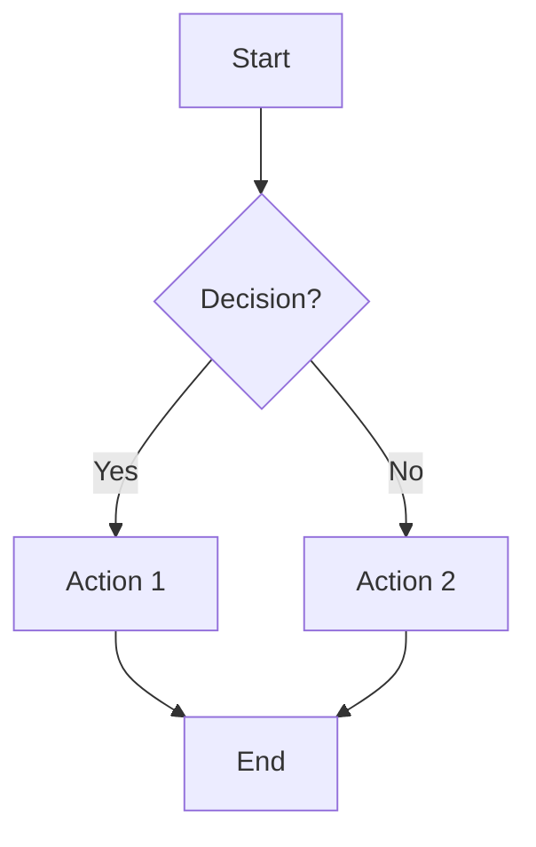
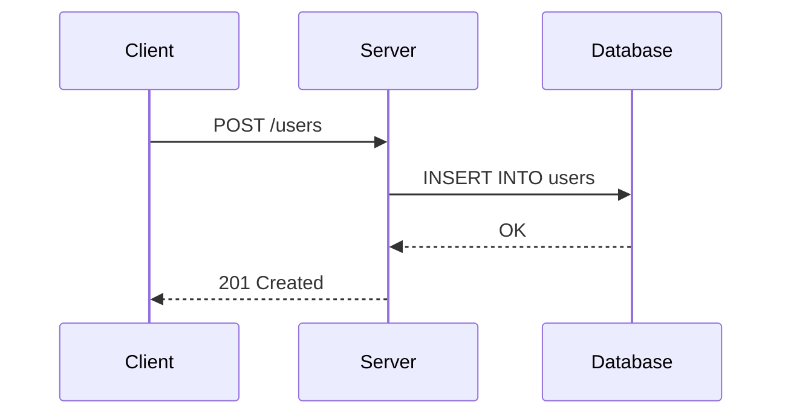
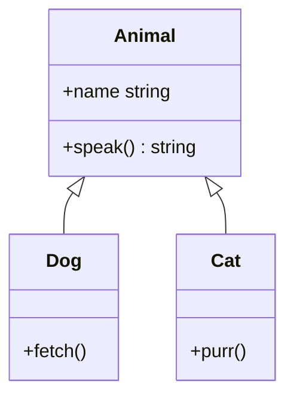
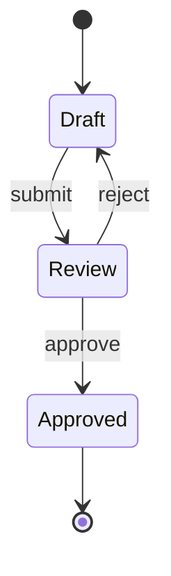
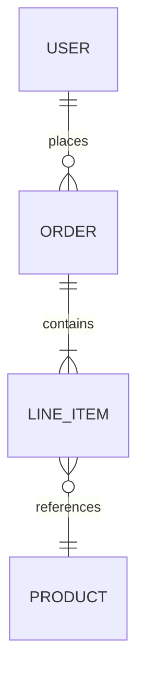

# Diagramming Cheat Sheet

## Diagram Type Selection

| Type              | When to Use                             | Communicates              |
| ----------------- | --------------------------------------- | ------------------------- |
| **Concept map**   | Showing how ideas relate to each other  | Relationships, ontology   |
| **Flowchart**     | Decision logic, branching processes     | Control flow, choices     |
| **Sequence**      | Request/response, multi-actor protocols | Interactions over time    |
| **Hierarchy**     | Classification, containment, org charts | Parent/child, scope       |
| **ER diagram**    | Data models, entity relationships       | Cardinality, associations |
| **State machine** | Lifecycle, valid transitions            | States, events, guards    |

**Decision heuristic:** What question does the diagram answer?

- "How do these relate?" → concept map
- "What happens next?" → flowchart
- "Who talks to whom?" → sequence
- "What contains what?" → hierarchy
- "What are the entities?" → ER
- "What states can this be in?" → state machine

## Mermaid Syntax

### Flowchart



Node shapes: `[rectangle]` `{diamond}` `([stadium])` `((circle))`
`[[subroutine]]`

Arrow styles: `-->` solid, `-.->` dotted, `==>` thick, `-- text -->` labeled

### Sequence



Arrow types: `->>` solid, `-->>` dashed, `-x` cross (lost), `--)` open

### Class / Hierarchy



### State Machine



### ER Diagram



Cardinality: `||` one, `o|` zero or one, `}|` one or more, `}o` zero or more

## ASCII Diagram Patterns

### Box Drawing

```text
┌──────────┐     ┌──────────┐
│  Client  │────▶│  Server  │
└──────────┘     └──────────┘
                      │
                      ▼
                 ┌──────────┐
                 │ Database │
                 └──────────┘
```

Characters: `┌ ┐ └ ┘ │ ─ ├ ┤ ┬ ┴ ┼` Arrows: `▶ ▼ ◀ ▲ → ← ↑ ↓`

### Tree Structure

```text
project/
├── src/
│   ├── main.go
│   └── handler.go
├── docs/
│   ├── setup.md
│   └── api.md
└── README.md
```

### Pipeline

```text
Input ──▶ Parse ──▶ Validate ──▶ Transform ──▶ Output
                        │
                        ▼
                    [Error Log]
```

## Concept Map Construction

A concept map is nodes (concepts) connected by labeled edges (relationships).

### Building One

1. **List concepts** — write every relevant noun
2. **Identify the root** — the broadest or most central concept
3. **Draw edges** — connect pairs with a verb describing the relationship
4. **Label every edge** — an unlabeled line is ambiguous
5. **Check direction** — arrows indicate dependency or derivation

```text
  ┌─────────┐   contains   ┌─────────┐
  │ Module  │─────────────▶│ Function│
  └─────────┘              └─────────┘
       │                        │
       │ imports                │ calls
       ▼                        ▼
  ┌─────────┐              ┌─────────┐
  │ Package │              │ Function│
  └─────────┘              └─────────┘
```

### Edge Labels Matter

```text
Bad:   A ──── B          (what's the relationship?)
Good:  A ──uses──▶ B     (clear dependency)
Good:  A ──contains──▶ B (clear containment)
```

## Rules of Thumb

- **7±2 nodes** per diagram — beyond that, split or group
- **One idea per diagram** — if the title needs "and," make two
- **Label everything** — nodes, edges, arrows, regions
- **Direction encodes meaning** — left-to-right for time, top-to-bottom for
  hierarchy, don't mix without reason
- **Proximity = relatedness** — group related nodes spatially
- **Don't decorate** — every visual element should carry information; if it
  doesn't communicate, remove it
- **Match the tool to the audience** — Mermaid for docs (renders in GitHub),
  ASCII for inline comments, Excalidraw for whiteboard sessions

## See Also

- [Knowledge Design](../why/knowledge-design.md) — When and why to use each
  diagram type
